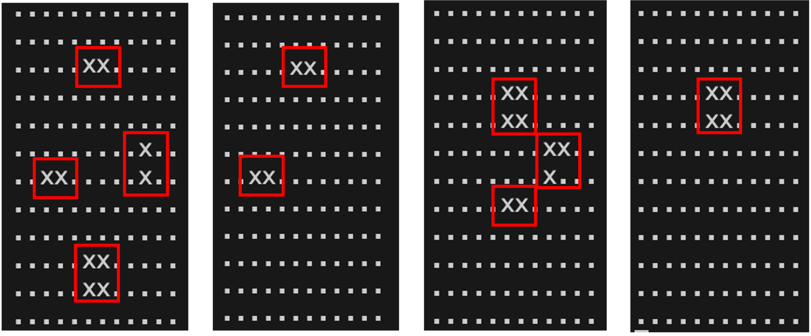
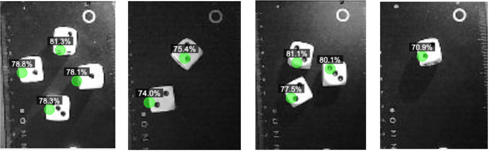

# Optimized Edge AI system for real-time visualization of FOMO object detection 

This project presents an extension and optimization of a system for visualizing object detection results on the ESP32-S3 microcontroller. It builds upon previous work in which the FOMO (Faster Objects, More Objects) model was optimized for embedded systems, and focuses on a complete end-to-end solution — from camera image acquisition, through inference of a quantized neural network model, to real-time visualization of detected objects in a web browser.

The project introduces a dual-threaded architecture utilizing both cores of the ESP32-S3, including a web server for video streaming (MJPEG) and a WebSocket server for real-time transmission of detections. Emphasis is placed on optimizing computational and memory efficiency. The inference runs on a dedicated core, external PSRAM is used for tensor allocation, and tasks are parallelized using FreeRTOS, with data access synchronized through mutexes and communication bandwidth minimized by sending only JSON centroid data.

Implementation details such as image downsampling, normalization for the quantized model, efficient video stream encoding, and thread synchronization are discussed in depth. The prototype achieves a smooth video stream (~30 FPS) with overlaid detection visualization and inference latency in the order of tens of milliseconds per evaluation. The results confirm that even on highly resource-constrained hardware, it is possible to implement a fully functional edge AI application for object detection with real-time visual feedback.

<p align="center">
  <br> ASCII representation of the real-time detection output
</p>
<p align="center">
  <br>Stream output with centroids overlaid
</p>

---

## Table of Contents

- [Overview](#overview)
- [Features](#features)
- [Hardware](#hardware)
- [Folder structure (key parts)](#folder-structure-key-parts)
- [Build & Installation (PlatformIO)](#build--installation-platformio)
- [Quick Start](#quick-start)
- [System Architecture](#system-architecture)
  - [Dual‑Core ESP32‑S3 Design](#dualcore-esp32s3-design)
  - [Inference Thread & Image Processing](#inference-thread--image-processing)
  - [FOMO Integration (TFLM)](#fomo-integration-tflm)
  - [Inference Loop, Thresholding & Publishing](#inference-loop-thresholding--publishing)
  - [Concurrency & Synchronization](#concurrency--synchronization)
- [Web Server, Streaming & Visualization](#web-server-streaming--visualization)
  - [MJPEG Stream](#mjpeg-stream)
  - [WebSocket Interface (JSON Schema)](#websocket-interface-json-schema)
  - [Client (HTML/JS) Visualization](#client-htmljs-visualization)
- [Runtime Services](#runtime-services)
- [Public API (Core Functions)](#public-api-core-functions)
- [Key Parameters (Tuning)](#key-parameters-tuning)
- [Performance Notes](#performance-notes)
- [Limitations & Tips](#limitations--tips)

---

## Overview

ESP32-S3-TFlowLiteMicroWebSocket is an edge‑AI reference showcasing a complete camera → inference → visualization pipeline on ESP32‑S3:

- Captures frames from OV2640 (ESP32‑S3 camera boards)
- Runs a TensorFlow Lite Micro FOMO model on Core 1 (int8, PSRAM tensor arena)
- Streams MJPEG over HTTP for live preview
- Sends real‑time detections (centroids) as JSON via WebSocket (port 81)
- Serves a minimal HTML UI from flash

The design prioritizes throughput and responsiveness on constrained hardware by:
- Using grayscale QQVGA frames and downsampling to 96×96 for inference
- Quantized model (int8) and PSRAM‑backed tensor arena
- Dual‑core FreeRTOS tasks (inference vs. WebSocket loop)
- Lightweight JSON (only centroids above threshold)

## Features

- Captures frames from **OV2640** camera (QQVGA, grayscale)
- Runs **int8 quantized FOMO** on **ESP32‑S3 Core 1** with PSRAM tensor arena
- Streams live video as **MJPEG** via HTTP (`/stream`)
- Sends detections as **JSON** via **WebSocket** (port 81)
- Serves a lightweight **HTML UI** from flash, overlaying detections on a `<canvas>`

## Hardware

- **MCU:** ESP32‑S3 (dual Xtensa LX7 up to 240 MHz), 512 KB SRAM + external **PSRAM** (2–8 MB recommended)
- **Camera:** OV2640 (pins defined in your board variant, e.g., `CAMERA_MODEL_TSIMCAM_ESP32S3`)
- **Note:** Enable PSRAM for a sufficiently large tensor arena (≈350 KB in this reference).

## Folder structure (key parts)

- `src/main.cpp` – application entry, camera, HTTP stream, WebSocket, inference tasks
- `src/html_gui.h` – HTML UI served at `/` (included as `html_gui.h`)
- `src/camera_pins.h` – settings type of camera pin definitions
- `include/fomo_model.h` – embedded TensorFlow Lite Micro FOMO model (int8 FlatBuffer as C array)
- `images/` – screenshots used in readme
- `platformio.ini` – PlatformIO configuration (board, flags, dependencies)

Model note: The FOMO model is compiled into the firmware as a C array in `include/fomo_model.h` and is referenced in code as `fomo_detector_int8_tflite`.

## Build & Installation (PlatformIO)

1. Open the project in **VS Code** with the **PlatformIO** extension.
2. Example `platformio.ini` (tune board and flags for your setup):

   ```ini
   [env:esp32s3]
   platform = espressif32
   board = esp32-s3-devkitc-1
   framework = arduino
   board_build.psram = enabled
   board_build.flash_size = 8MB
   build_flags =
     -DBOARD_HAS_PSRAM
     -DARDUINO_USB_MODE=1
     -DARDUINO_USB_CDC_ON_BOOT=1
     -mfix-esp32-psram-cache-issue
     -DCORE_DEBUG_LEVEL=3
     -DPSRAM_ENABLE
     -DBOARD_HAS_TENSOR_ARENA
   lib_deps =
     esp32-camera
     tanakamasayuki/TensorFlowLite_ESP32@^1.0.0
     bblanchon/ArduinoJson@^7.3.0
     Links2004/WebSockets@^2.3.6
     ottowinter/ESPAsyncWebServer-esphome@^3.0.0
   ```

3. Build & upload. Open **Serial Monitor** at **115200** baud.

## Quick Start

1. Flash the firmware.
2. Read the **device IP** from Serial logs.
3. Open a browser at `http://<device-ip>/` to load the HTML UI.
4. The live MJPEG stream is at `http://<device-ip>/stream`.
5. WebSocket detections: `ws://<device-ip>:81/`.

---

## System Architecture

The system combines several subsystems that cooperate via **parallel FreeRTOS tasks**, **mutex‑based synchronization**, and **network I/O** (HTTP streaming + WebSocket) to achieve responsive real‑time visualization on constrained hardware.

**Core components:**

- **TFLM Inference Engine** — Runs directly on ESP32‑S3 (int8 FOMO).
- **OV2640 Camera** — Captures grayscale frames; frames are downsampled and processed.
- **HTTP MJPEG Server** — Streams images as a live video feed.
- **WebSocket Server** — Sends JSON with detected **centroids** in parallel.
- **HTML/Canvas Client** — Served from flash, renders the stream and overlays detections.

### Dual‑Core ESP32‑S3 Design

ESP32‑S3 offers two Xtensa LX7 cores (up to 240 MHz) and supports **true dual‑core scheduling** under FreeRTOS. We dedicate:

- **Core 1** → **Inference** (higher priority task)
- **Core 0** → **Networking** (WebSocket + HTTP handlers)

This prevents the compute‑heavy path from blocking network responsiveness.

Example task pinning:

```cpp
// Launching an inference thread on core 1 (higher priority)
xTaskCreatePinnedToCore(inferenceTask, "InferenceTask", 8192, NULL, 2, NULL, 1);
// Launching the WebSocket server thread on core 0 (lower priority)
xTaskCreatePinnedToCore(webSocketTask, "WebSocketTask", 4096, NULL, 1, NULL, 0);
```

### Inference Thread & Image Processing

- **Camera mode:** QQVGA **160×120**, **grayscale**.
- **Model input:** **96×96** (downsampled from 160×120 via simple scaling).
- **Quantization:** int8; pixels mapped to the expected range for the model.
- **Buffering:** temporary `uint8_t resized[96*96]` (or equivalent) for downsampling.

Grayscale and low resolution reduce memory and bandwidth while remaining sufficient for larger targets. Frames are captured using `esp_camera_fb_get()` (JPEG in HW), then resized/converted for inference as needed.

### FOMO Integration (TFLM)

The trained **int8** `.tflite` model is embedded as a C array and loaded at boot:

```cpp
const tflite::Model* model = tflite::GetModel(fomo_detector_int8_tflite);
static tflite::MicroInterpreter interpreter(
    model, resolver, tensor_arena, TENSOR_ARENA_SIZE, error_reporter);
```

- **Tensor arena** (~350 KB) is placed in **external PSRAM** to preserve internal DRAM.
- Operator registrations are compiled into the firmware via a static `resolver`.

### Inference Loop, Thresholding & Publishing

A periodic loop captures, resizes, quantizes, and invokes the model:

```cpp
TfLiteStatus invokeStatus = interpreter.Invoke();
```

- Typical **Invoke()** latency: **tens of milliseconds** per frame (measured on‑device).
- The output tensor is **12×12 = 144** scores (probabilities per grid cell).
- A constant `THRESHOLD = 0.6` filters weak activations.
- Detected cells are serialized to JSON and **broadcast** via WebSocket.

To balance compute vs. I/O and keep the stream smooth, a short delay is used:

```cpp
Serial.printf("Inference took %lu ms\n", duration);
vTaskDelay(pdMS_TO_TICKS(150));  // ~6–7 Hz inference cadence
```

### Concurrency & Synchronization

A **mutex** (e.g., `result_mutex`) guards shared inference outputs while the WebSocket thread serializes them to JSON. This ensures **consistent snapshots** (no mixing of previous and current frames). The HTTP stream runs in its own handlers on Core 0 (ESP‑IDF `httpd`).

---

## Web Server, Streaming & Visualization

Both services are implemented with Arduino‑compatible libs and ESP‑IDF components:

- **HTTP (port 80):** serves `/` (HTML UI) and `/stream` (MJPEG).
- **WebSocket (port 81):** broadcasts detection JSON to all connected clients.

### MJPEG Stream

Motion JPEG is a sequence of JPEGs separated by a boundary over a single HTTP response. Browsers support this natively via an `` tag:

```html

```

Server setup (simplified):

```cpp
httpd_handle_t camera_httpd = nullptr;
httpd_config_t config = HTTPD_DEFAULT_CONFIG();
config.server_port = 80;
config.max_uri_handlers = 8;
config.stack_size = 8192;

// Serve "/" with built-in HTML
httpd_uri_t uri_index = {
  .uri = "/",
  .method = HTTP_GET,
  .handler = [](httpd_req_t *req){
    httpd_resp_send(req, INDEX_HTML, strlen(INDEX_HTML));
    return ESP_OK;
  }
};

// Serve MJPEG stream at "/stream"
httpd_uri_t uri_stream = {
  .uri = "/stream",
  .method = HTTP_GET,
  .handler = stream_handler
};

httpd_start(&camera_httpd, &config);
httpd_register_uri_handler(camera_httpd, &uri_index);
httpd_register_uri_handler(camera_httpd, &uri_stream);
```

`stream_handler` loops: acquire frame → ensure JPEG → write multipart boundary + headers + JPEG bytes. With **160×120 grayscale**, bandwidth is modest; 30 FPS is achievable on LAN.

### WebSocket Interface (JSON Schema)

Each broadcast is an array of detections (grid indices + confidence in [0..1]):

```json
[
  { "x": 2, "y": 5, "confidence": 0.87 },
  { "x": 7, "y": 5, "confidence": 0.64 }
]
```

Server‑side serialization (sketch):

```cpp
DynamicJsonDocument doc(1024);
for (int i = 0; i < GRID_SIZE*GRID_SIZE; ++i) {
  float confidence = output_tensor[i];
  if (confidence > THRESHOLD) {
    JsonObject det = doc.createNestedObject();
    det["x"] = i % GRID_SIZE;
    det["y"] = i / GRID_SIZE;
    det["confidence"] = confidence;
  }
}
String jsonStr; serializeJson(doc, jsonStr);
webSocket.broadcastTXT(jsonStr);
```

### Client (HTML/JS) Visualization

The HTML page (stored in PROGMEM) stacks a `<canvas>` over the MJPEG `` and draws green dots at the **centroids** of detected grid cells. The client filters detections client‑side as well (tunable threshold) and merges adjacent cells into a single detection to reduce duplicates.

Sketch of the rendering loop:

```js
function renderFrame() {
  ctx.clearRect(0, 0, canvas.width, canvas.height);
  if (video.complete && video.naturalWidth > 0) {
    ctx.drawImage(video, 0, 0, canvas.width, canvas.height);
  }
  const groups = groupDetections(latestDetections);
  groups.forEach(({ x, y, confidence }) => {
    const centerX = (x + 0.5) * CELL_WIDTH;
    const centerY = (y + 0.5) * CELL_HEIGHT;
    ctx.beginPath(); ctx.arc(centerX, centerY, 8, 0, 2*Math.PI);
    ctx.fillStyle = "rgba(0, 255, 0, 0.6)"; ctx.fill();
    ctx.strokeStyle = "#00FF00"; ctx.stroke();
    const label = `${(confidence * 100).toFixed(1)}%`;
    const w = ctx.measureText(label).width;
    ctx.fillStyle = "rgba(0,0,0,0.7)";
    ctx.fillRect(centerX - w/2 - 4, centerY - 18, w + 8, 14);
    ctx.fillStyle = "#fff"; ctx.fillText(label, centerX - w/2, centerY - 8);
  });
  requestAnimationFrame(renderFrame);
}
```

---

## Runtime Services

- **HTTP server (80)**
  - `GET /` — serves the HTML UI (from flash/PROGMEM)
  - `GET /stream` — MJPEG stream (`multipart/x-mixed-replace`)
  - (Optional) CORS preflight handlers

- **WebSocket server (81)**
  - Broadcasts centroid detections as JSON after each inference

## Public API (Core Functions)

- `setupWiFi()` — connect to AP, print IP
- `startCameraServer()` — start HTTP server & register routes
- `stream_handler()` — MJPEG multipart response loop
- `startWebSocketServer()` — start WS, hook `webSocketEvent`
- `runInference()` — capture → resize → quantize → `Invoke()`
- `sendDetectionsWebSocket()` — serialize & broadcast detections
- `inferenceTask()` / `webSocketTask()` — FreeRTOS tasks (pinned)

## Key Parameters (Tuning)

- **Input size:** `96×96×1`
- **Output grid:** `GRID_SIZE = 12` → 12×12 cells
- **Detection threshold:** `THRESHOLD = 0.6`
- **Tensor arena:** `TENSOR_ARENA_SIZE ≈ 350 KB` (PSRAM)
- **Camera:** `PIXFORMAT_GRAYSCALE`, `FRAMESIZE_QQVGA`, `xclk_freq_hz = 20 MHz`
- **Cadence:** ~150 ms delay → ~6–7 Hz inference

## Performance Notes

- Inference typically takes **tens of ms** per frame.
- MJPEG quality ~**80%** is a good default (quality vs. bandwidth).
- `WiFi.setSleep(false)` often improves streaming stability.

## Limitations & Tips

- No authentication — use on **trusted networks**.
- Ensure **PSRAM** is enabled; insufficient arena causes `AllocateTensors()` failures.
- If you change input size or grid layout, **update constants & parsing**.

---

### Using Your Own FOMO Model

1. Replace the C array in `include/fomo_model.h` with your converted **int8** TFLite model.
2. Ensure the symbol name matches your code references (e.g., `fomo_detector_int8_tflite`).
3. Keep input shape **96×96×1** and an output compatible with a **12×12** grid (or adjust parsing/constants).

---

**Enjoy building real‑time edge AI on ESP32‑S3!**
